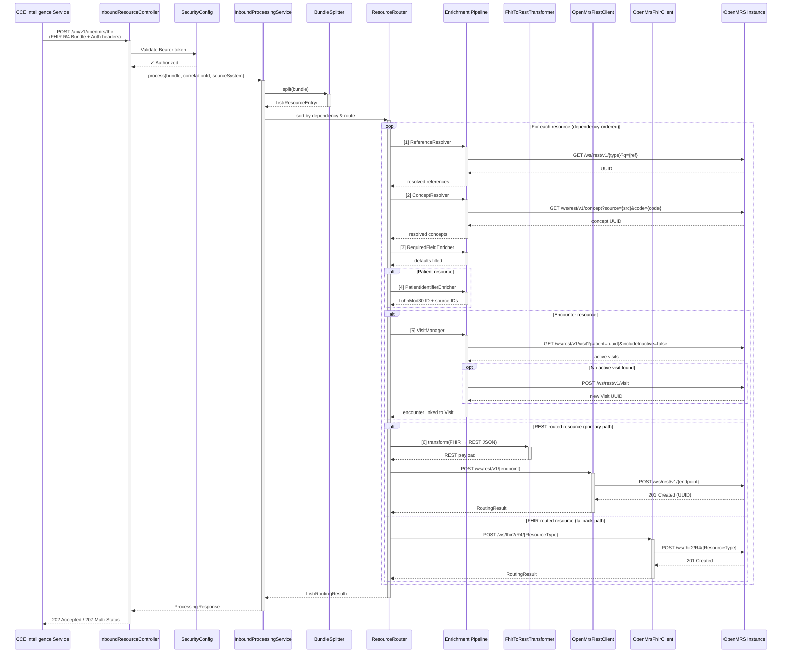
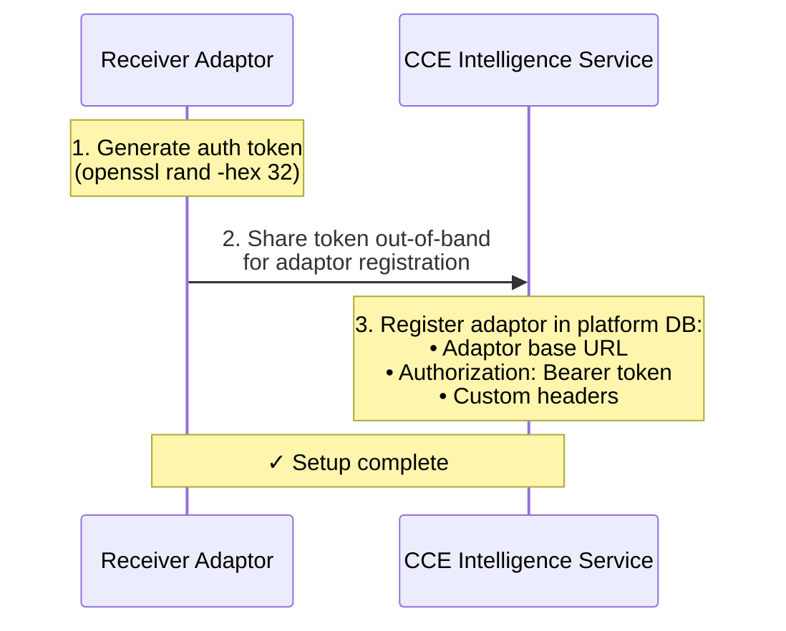
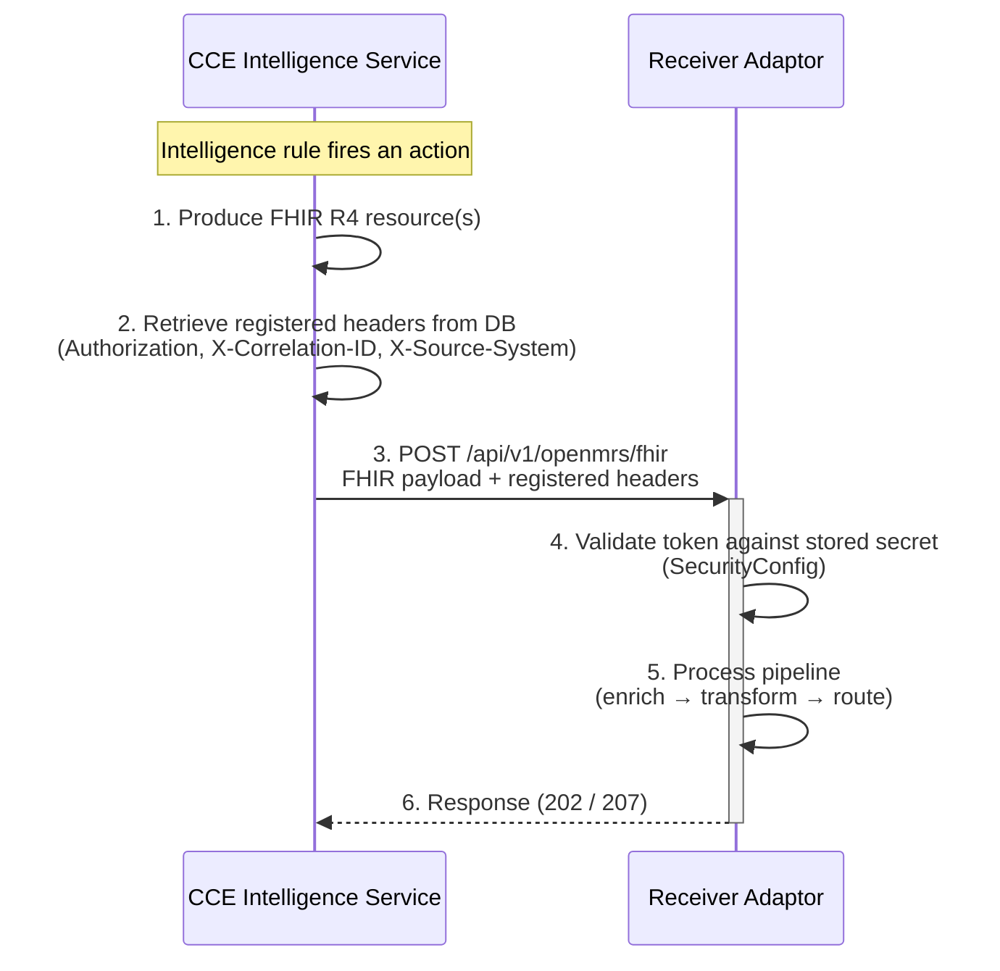

# Architecture — OpenMRS CCE Receiver Adaptor

## 1. Service Purpose

The **OpenMRS CCE Receiver Adaptor** is a Spring Boot middleware that receives FHIR R4 payloads from **CCE Core (Intelligence Service)**, transforms them into OpenMRS-native payloads, and writes them into an OpenMRS O3 instance. It is invoked by the Intelligence Service as an action output — when intelligence rules determine that clinical data should be written to OpenMRS, the Intelligence Service produces FHIR R4 resources and POSTs them to this adaptor. It uses the **REST v1 API as the primary write path** with FHIR R4 as a fallback for resource types without REST coverage.

---

## 2. System Context

```
  CCE Core                                                            OpenMRS O3
  (Intelligence Service)                                             Instance
         │                                                              ▲
         │ FHIR R4                                                      │
         │ (Bundle or standalone)                                       │
         │ triggered by intelligence actions                            │
         ▼                                                              │
  ★ CCE Receiver Adaptor ★ ─── REST JSON ──► /ws/rest/v1  ────────────┘
        :8080                 └── FHIR+JSON ─► /ws/fhir2/R4 ───────────┘
```

The adaptor is the **receiver** component in the CCE architecture — it receives FHIR R4 resources produced by the Intelligence Service and writes them into OpenMRS. The Intelligence Service aggregates and processes data from upstream health systems (RHIE, SPICE, eBuzima) and produces standardised FHIR R4 resources as action outputs. The adaptor is NOT a pass-through proxy; it actively transforms, enriches, and resolves every resource before forwarding to OpenMRS.

---

## 3. Component Architecture

```
┌───────────────────────────────────────────────────────────────────────────┐
│                       CCE Receiver Adaptor                                │
│                                                                           │
│  ┌─────────────────────────────────────────────────────────────────────┐  │
│  │                         Inbound Layer                               │  │
│  │                                                                     │  │
│  │  ┌───────────────────────────────────────────────────────────────┐  │  │
│  │  │  InboundResourceController                                    │  │  │
│  │  │  POST /api/v1/openmrs/fhir — main entry point                        │  │  │
│  │  │  Extracts X-Correlation-ID, X-Source-System headers           │  │  │
│  │  └───────────────────────────────────────────────────────────────┘  │  │
│  └──────────────────────────────┬──────────────────────────────────────┘  │
│                                 │                                         │
│                                 ▼                                         │
│  ┌─────────────────────────────────────────────────────────────────────┐  │
│  │                      Processing Layer                               │  │
│  │                                                                     │  │
│  │  InboundProcessingService (Orchestrator)                            │  │
│  │       │                                                             │  │
│  │       ▼                                                             │  │
│  │  BundleSplitter ── Bundle → List<ResourceEntry>                     │  │
│  │       │                                                             │  │
│  │       ▼                                                             │  │
│  │  ResourceRouter ── Dependency sort + REST/FHIR routing decision     │  │
│  │       │               ◄──► SourceIdMappingStore                     │  │
│  │       │                                                             │  │
│  │       ▼                                                             │  │
│  │  ┌─────────────────────────────────────────────────────────────┐    │  │
│  │  │  Enrichment Pipeline (per resource)                         │    │  │
│  │  │                                                             │    │  │
│  │  │  [1] ReferenceResolver     — non-UUID refs → OpenMRS UUIDs  │    │  │
│  │  │  [2] ConceptResolver       — LOINC/SNOMED/ICD → concept UUID│    │  │
│  │  │  [3] RequiredFieldEnricher — auto-fill missing fields        │    │  │
│  │  │  [4] PatientIdentifierEnricher — LuhnMod30 + source IDs     │    │  │
│  │  │  [5] VisitManager          — auto-create Visit linkage       │    │  │
│  │  └─────────────────────────────────────────────────────────────┘    │  │
│  └──────────────────────────────┬──────────────────────────────────────┘  │
│                    ┌────────────┴───────────┐                             │
│                    ▼                        ▼                             │
│  ┌──────────────────────────┐  ┌──────────────────────────────┐          │
│  │  REST Path (PRIMARY)     │  │  FHIR Path (FALLBACK)        │          │
│  │                          │  │                              │          │
│  │  FhirToRestTransformer   │  │  FhirElementIdEnricher       │          │
│  │       │                  │  │       │                      │          │
│  │  OpenMrsRestClient       │  │  OpenMrsFhirClient           │          │
│  │  POST/PUT → /ws/rest/v1  │  │  POST/PUT → /ws/fhir2/R4    │          │
│  └──────────┬───────────────┘  └──────────┬───────────────────┘          │
│             │                              │                             │
│  ┌──────────────────────────────────────────────────────────────────┐    │
│  │                       Support Layer                              │    │
│  │  OpenMrsProperties │ DiscoveredConfig │ OpenMrsConfigDiscovery   │    │
│  │  RestClientConfig  │ SecurityConfig   │ FhirConfig               │    │
│  │  OAuth2TokenProvider │ RetryConfig                               │    │
│  └──────────────────────────────────────────────────────────────────┘    │
└───────────────────────────────────────────────────────────────────────────┘
                    │                              │
                    ▼                              ▼
          ┌─────────────────┐          ┌──────────────────────┐
          │  OpenMRS REST   │          │  OpenMRS FHIR        │
          │  /ws/rest/v1    │          │  /ws/fhir2/R4        │
          │                 │          │                      │
          │  Patient        │          │  Procedure           │
          │  Encounter      │          │  DiagnosticReport    │
          │  Obs, Order     │          │  MedicationDispense  │
          │  Condition      │          │  MedicationAdmin.    │
          │  Allergy, Visit │          │  Task                │
          │  Provider, Drug │          │  Consent             │
          │  Location       │          │                      │
          │  Immunization*  │          │                      │
          └─────────────────┘          └──────────────────────┘
          * Immunization stored as obs group via REST /obs
```

---

## 3.1 End-to-End Sequence Diagram

The following sequence diagram shows the full request lifecycle — from the CCE Intelligence Service sending a FHIR R4 Bundle through to OpenMRS writes.



---

## 4. Technology Stack

| Concern | Technology | Version |
|---------|------------|---------|
| Language | Java | 21 (LTS) |
| Framework | Spring Boot | 3.4.1 |
| Build tool | Gradle (Groovy DSL) | 8.x |
| FHIR library | HAPI FHIR (R4 structures) | 7.4.0 |
| HTTP client | Spring `RestClient` | (Spring Boot managed) |
| Security | Spring Security + OAuth2 Resource Server | (Spring Boot managed) |
| Retry | Spring Retry + Spring Aspects | (Spring Boot managed) |
| Health & metrics | Spring Boot Actuator + Micrometer + Prometheus | |
| Testing | JUnit 5, Mockito, WireMock | 3.9.2 |

### 4.1 Key Gradle Dependencies

```groovy
// HAPI FHIR (inbound parsing only — outbound uses Jackson for REST payloads)
implementation "ca.uhn.hapi.fhir:hapi-fhir-base:${hapiFhirVersion}"
implementation "ca.uhn.hapi.fhir:hapi-fhir-structures-r4:${hapiFhirVersion}"

// Spring Boot starters
implementation 'org.springframework.boot:spring-boot-starter-web'
implementation 'org.springframework.boot:spring-boot-starter-actuator'
implementation 'org.springframework.boot:spring-boot-starter-validation'
implementation 'org.springframework.boot:spring-boot-starter-security'
implementation 'org.springframework.boot:spring-boot-starter-oauth2-resource-server'
implementation 'org.springframework.retry:spring-retry'
implementation 'org.springframework:spring-aspects'

// Metrics
implementation 'io.micrometer:micrometer-registry-prometheus'

// Testing
testImplementation 'org.springframework.boot:spring-boot-starter-test'
testImplementation 'org.springframework.security:spring-security-test'
testImplementation "org.wiremock:wiremock-standalone:${wiremockVersion}"
```

---

## 5. Package Structure

### 5.1 Source Structure

```
src/main/java/org/openphc/cce/receiver/
├── CceReceiverAdaptorApplication.java          # Spring Boot entry point
├── config/
│   ├── OpenMrsProperties.java                  # @ConfigurationProperties — immutable YAML binding
│   ├── DiscoveredConfig.java                   # Mutable runtime config from auto-discovery
│   ├── OpenMrsConfigDiscovery.java             # Startup auto-discovery from OpenMRS REST API
│   ├── RestClientConfig.java                   # Two RestClient beans (REST + FHIR) with dual auth
│   ├── SecurityConfig.java                     # Inbound API auth (disabled/Basic/JWT)
│   ├── OAuth2TokenProvider.java                # Outbound OAuth2 Client Credentials token cache
│   ├── RetryConfig.java                        # Spring Retry configuration
│   └── FhirConfig.java                         # Singleton FhirContext.forR4()
├── controller/
│   └── InboundResourceController.java          # POST /api/v1/openmrs/fhir — main entry point
├── model/
│   ├── ResourceEntry.java                      # record(resourceType, resourceJson, method, fullUrl)
│   ├── RoutingResult.java                      # record(resourceType, resourceId, route, status, ...)
│   └── ProcessingResponse.java                 # record(timestamp, totalEntries, succeeded, failed, results)
├── service/
│   ├── InboundProcessingService.java           # Orchestrator: split → route → aggregate
│   ├── BundleSplitter.java                     # Decompose Bundle / wrap standalone resource
│   ├── ResourceRouter.java                     # Dependency ordering + REST-first routing
│   ├── OpenMrsRestClient.java                  # PRIMARY: REST v1 client with enrichment + retry
│   ├── OpenMrsFhirClient.java                  # FALLBACK: FHIR R4 client
│   ├── SourceIdMappingStore.java               # Per-request Bundle cross-reference map
│   ├── ConceptResolver.java                    # LOINC/SNOMED/CIEL/ICD-11/NPC → concept UUID
│   ├── ReferenceResolver.java                  # Resolves non-UUID references via REST search
│   ├── PatientIdentifierEnricher.java          # LuhnMod30 ID generation + source ID promotion
│   ├── RequiredFieldEnricher.java              # Auto-fills missing required fields
│   ├── VisitManager.java                       # Auto-creates Visits for Encounters
│   └── FhirToRestTransformer.java              # FHIR → OpenMRS REST payload (ALL resource types)
├── fhir/
│   └── FhirResourceParser.java                 # HAPI FHIR parse/encode wrapper
└── exception/
    ├── FhirParsingException.java               # 422 — invalid FHIR JSON
    ├── ResourceTransformException.java         # 422 — FHIR→REST transform failure
    ├── OpenMrsClientException.java             # 502 — OpenMRS communication failure
    └── GlobalExceptionHandler.java             # @ControllerAdvice — JSON error responses
```

| Package | Files | Responsibility |
|---------|-------|----------------|
| `config` | 8 | Properties, REST clients, security, retry, FHIR context, auto-discovery |
| `controller` | 1 | Inbound FHIR endpoint |
| `model` | 3 | Request/response records |
| `service` | 12 | Processing pipeline, enrichment, transformation, routing |
| `fhir` | 1 | HAPI FHIR parsing wrapper |
| `exception` | 4 | Custom exceptions and global error handler |

### 5.2 Test Structure

```
src/test/java/org/openphc/cce/receiver/
├── CceReceiverAdaptorApplicationTests.java       # Context load test
├── config/
│   ├── OpenMrsPropertiesTest.java                # Config binding tests
│   └── RestClientConfigTest.java                 # RestClient bean tests
├── service/
│   ├── FhirToRestTransformerTest.java            # All resource type transformations
│   ├── ConceptResolverTest.java                  # Concept resolution + caching
│   ├── ReferenceResolverTest.java                # Reference resolution via REST search
│   ├── PatientIdentifierEnricherTest.java        # LuhnMod30 + source ID promotion
│   ├── RequiredFieldEnricherTest.java            # Default field population
│   ├── BundleSplitterTest.java                   # Bundle decomposition
│   ├── ResourceRouterTest.java                   # Dependency ordering + routing decisions
│   └── VisitManagerTest.java                     # Visit find/create
└── integration/
    ├── AbstractIntegrationTest.java              # WireMock base (OpenMRS REST + FHIR stubs)
    ├── PatientPipelineIntegrationTest.java        # Patient Bundle end-to-end
    ├── EncounterPipelineIntegrationTest.java      # Encounter + Visit linkage
    └── HealthEndpointIntegrationTest.java         # Actuator health endpoint tests
```

| Suite | Scope | Strategy |
|-------|-------|----------|
| `config/` | Unit | Verify property binding, bean creation |
| `service/` | Unit | Mockito-based — mock REST clients, discovery config |
| `integration/` | Integration | WireMock stubs for OpenMRS REST + FHIR endpoints |

---

## 6. REST-First Routing Strategy

### 6.1 Why REST-First

The OpenMRS FHIR module (`fhir2`) has gaps that make it unreliable as the primary write path:

| Gap | Impact | REST Solution |
|-----|--------|---------------|
| No Order support | `ServiceRequest`/`MedicationRequest` fail | REST `/order` supports `testorder`/`drugorder` |
| No Visit creation | Encounters invisible in O3 UI | REST `/visit` creates Visits directly |
| Sub-element UUID requirement | `ConstraintViolationException` | REST auto-generates UUIDs |
| Identifier type mapping fragility | Identifiers silently dropped | REST sets `identifierType` by UUID |
| Concept resolution gaps | FHIR doesn't resolve LOINC→CIEL | REST accepts concept UUID directly |
| Encounter type confusion | FHIR merges Visits + Encounters | REST has separate endpoints |

### 6.2 Routing Decision

```
if resourceType in FHIR_ONLY_TYPES → FHIR fallback path
else → REST primary path (default for ALL types)
```

**`FHIR_ONLY_TYPES`** — resource types routed to the FHIR endpoint because OpenMRS REST API does not have native endpoints for them:

| Resource Type | Reason for FHIR | OpenMRS Backend |
|---|---|---|
| DiagnosticReport | No dedicated REST endpoint | Stored as Encounter + grouped Obs via FHIR module |
| Procedure | No dedicated REST endpoint | Stored as `obs` via FHIR module |
| MedicationDispense | No dedicated REST endpoint | Requires `fhir2` dispensing support |
| MedicationAdministration | No dedicated REST endpoint | Requires `fhir2` module |
| Task | FHIR-native `fhir_task` table | REST `/task` is not standard; FHIR module manages directly |
| Consent | No dedicated REST endpoint | Requires `fhir2` module (if supported) |

> **Note:** Immunization was moved to the **REST path** — OpenMRS models immunizations as observation groups, so the adaptor transforms FHIR Immunization resources into REST `/obs` payloads (obs group with vaccine concept). The remaining FHIR-only types (Procedure, DiagnosticReport, MedicationDispense, MedicationAdministration, Task, Consent) are backed by the `fhir2` module which stores them as synthetic mappings (obs groups, encounters, or dedicated FHIR tables). Only core OpenMRS domain objects (Patient, Encounter, Obs, Order, Condition, Allergy, Visit, Provider, Location, Drug) plus Immunization (via obs) have true REST endpoints.

### 6.3 Resource → Endpoint Mapping

| FHIR Resource | REST Endpoint | REST Type |
|---------------|---------------|-----------|
| Patient | `/patient` | patient |
| Encounter | `/encounter` | encounter |
| Observation | `/obs` | obs |
| Condition | `/condition` | condition |
| AllergyIntolerance | `/allergy` | allergy |
| ServiceRequest | `/order` | testorder |
| MedicationRequest | `/order` | drugorder |
| Location | `/location` | location |
| Practitioner | `/provider` | provider |
| Medication | `/drug` | drug |
| Immunization | `/obs` | obs group (vaccine concept as obs group) |
| Procedure | FHIR `/Procedure` | FHIR fallback |
| DiagnosticReport | FHIR `/DiagnosticReport` | FHIR fallback |
| Task | FHIR `/Task` | FHIR fallback |
| MedicationDispense | FHIR `/MedicationDispense` | FHIR fallback |
| MedicationAdministration | FHIR `/MedicationAdministration` | FHIR fallback |
| Consent | FHIR `/Consent` | FHIR fallback |

### 6.4 Dependency Ordering

Resources are sorted before processing to ensure dependencies exist:

| Priority | Resource Type | Reason |
|----------|---------------|--------|
| 1 | Patient | All other resources reference a Patient |
| 2 | Practitioner | Referenced by Encounters, Observations, Orders |
| 3 | Location | Referenced by Encounters, Identifiers |
| 4 | Medication | Referenced by MedicationRequest/Dispense |
| 5 | Encounter | Referenced by Observations, Orders, Conditions |
| 10 | Everything else | Default priority |

---

## 7. Enrichment Pipeline

Each resource passes through enrichers in strict order **before** the REST transformer:

```
[1] ReferenceResolver        — resolve non-UUID references to OpenMRS UUIDs
[2] ConceptResolver          — resolve LOINC/SNOMED/ICD codes to concept UUIDs
[3] RequiredFieldEnricher    — auto-fill missing required fields
[4] PatientIdentifierEnricher — (Patient only) LuhnMod30 + source ID promotion
[5] VisitManager             — (Encounter only) find/create Visit linkage
[6] FhirToRestTransformer    — convert enriched FHIR JSON → REST payload
```

### 7.1 ReferenceResolver

Walks the JSON tree of each resource, finds all `"reference"` fields, and resolves non-UUID identifiers to OpenMRS UUIDs via REST search.

**Resolution logic per reference:**
1. Parse `ResourceType/identifier` from the reference value
2. If the identifier looks like a UUID → **verify** it exists in OpenMRS: `GET /{endpoint}/{uuid}`
   - Found (200) → confirmed OpenMRS UUID → keep as-is
   - Not found (404) → source-system UUID → fall through to step 3
3. Search OpenMRS REST API using the type-specific endpoint below
4. Extract UUID from first match in `results[]` → replace reference value
5. If no match found → leave reference as-is (downstream will fail with a clear error)

| Reference Type | REST Search Endpoint | Match Strategy |
|----------------|---------------------|----------------|
| Patient | `GET /patient?identifier={id}&v=default` | Match by patient identifier value (NID, UPI, etc.) |
| Practitioner | `GET /provider?q={id}&v=default` | Match by provider identifier or name |
| Location | `GET /location?q={id}&v=default` | Match by location name or tag |
| Encounter | `GET /encounter?q={id}&v=default` | Match by encounter UUID directly |
| Medication | `GET /drug?q={id}&v=default` | Match by drug name or concept |
| *(any other type)* | `GET /{restEndpoint}?q={id}&v=default` | Generic fallback — search by query string |

> **Generic fallback:** Any resource type not listed above still gets resolved via the generic `?q=` search against its corresponding REST endpoint. This covers edge cases like Organization, DiagnosticReport references, etc.

**No caching:** Every reference is resolved directly from OpenMRS via REST API on every request. This ensures the adaptor always reflects the current state of OpenMRS — if a resource is added or updated in OpenMRS, the next request will see it immediately.

**Patient Identifier Lookup:**

When a patient reference is not a UUID (e.g., `Patient/1198503150001234` — an NID), the adaptor searches OpenMRS by identifier: `GET /patient?identifier={id}&v=default`. This covers NID, UPI, and other identifier types stored in the OpenMRS `patient_identifier` table.

**Provider Identifier Lookup:**

When a practitioner reference is not a UUID (e.g., `Practitioner/581`), the adaptor searches OpenMRS providers: `GET /provider?q={id}&v=default`. If no provider is found, it falls back to the Unknown Provider.

**Encounter Resolution for Orders:**

When an encounter reference is not a UUID (e.g., `Encounter/2243` — a SPICE encounter ID), the adaptor creates a new Consultation encounter linked to the patient's active visit (per the POC pattern — new encounter per ordering act to maintain audit trail integrity). It does NOT reuse an existing encounter.

### 7.2 ConceptResolver

Maps FHIR code system URIs to OpenMRS concept sources and resolves codes to OpenMRS concept UUIDs.

**System-to-Source Mapping:**

| FHIR `system` URI | OpenMRS Source |
|---|---|
| `http://loinc.org` | LOINC |
| `http://snomed.info/sct` | SNOMED CT |
| `urn:oid:2.16.840.1.113883.6.96` | SNOMED CT |
| `http://hl7.org/fhir/sid/icd-10` | ICD-10-WHO |
| `http://hl7.org/fhir/sid/icd-10-cm` | ICD-10-WHO |
| `https://icd.who.int` | ICD-11 |
| `http://www.nlm.nih.gov/research/umls/rxnorm` | RxNORM |
| `http://hl7.org/fhir/sid/cvx` | CVX |
| `http://npc.rw` | NPC |
| `http://www.ichi.org/` | ICHI |
| `urn:ietf:rfc:3986` | CIEL |
| `http://ciel.org` | CIEL |
| `https://openconceptlab.org/orgs/CIEL/sources/CIEL` | CIEL |
| `https://openconceptlab.org/orgs/Medtronic-LABS/sources/SPICE` | SPICE |
| `http://fhir.openmrs.org` | Native (use code as-is) |
| `http://openmrs.org` | Native (use code as-is) |

**Resolution Cascade:**
1. If coding has an OpenMRS-native system (`http://fhir.openmrs.org`, `http://openmrs.org`) → **verify** the code exists in OpenMRS: `GET /concept/{code}`
   - Found (200) → confirmed OpenMRS concept UUID → use as-is
   - Not found (404) → throw `ResourceTransformException` (native system must have valid OpenMRS concept UUID)
2. If code matches UUID pattern → **verify** it exists in OpenMRS: `GET /concept/{uuid}`
   - Found (200) → confirmed OpenMRS concept UUID → use as-is
   - Not found (404) → source-system UUID → fall through to step 3
3. Map `system` → OpenMRS source name → call `GET /concept?source={source}&code={code}`
4. If not found → throw `ResourceTransformException` with actionable error message

**Fields Processed (CODEABLE_CONCEPT_FIELDS):**

| Field | Used By |
|---|---|
| `code` | Observation, Condition, Procedure, DiagnosticReport |
| `medicationCodeableConcept` | MedicationRequest, MedicationDispense, MedicationAdministration |
| `vaccineCode` | Immunization |
| `valueCodeableConcept` | Observation |
| `bodySite` | Procedure, Condition |
| `method` | Observation |
| `clinicalStatus` | Condition, AllergyIntolerance |
| `verificationStatus` | Condition, AllergyIntolerance |
| `severity` | AllergyIntolerance |
| `serviceType` | Encounter |
| `reasonCode` | ServiceRequest, Encounter |
| `component[].code` | Observation (e.g., blood pressure systolic/diastolic components) |

**No caching:** Every concept is resolved directly from OpenMRS via `GET /concept?source={source}&code={code}` on every request. Resolved UUIDs are cached in a per-instance `ConcurrentHashMap` to avoid repeated lookups for the same source/code pair. A `__NOT_FOUND__` sentinel prevents repeated network calls for concepts that don't exist in the dictionary.

**Caching:** Resolved concept UUIDs are cached in a per-instance `ConcurrentHashMap` with a `NOT_FOUND` sentinel value to avoid repeated lookups for missing concepts. Cache entries persist for the lifetime of the application instance.

| Cache Key | Value | Sentinel |
|---|---|---|
| `source:code` (e.g., `LOINC:55433-2`) | Concept UUID | `__NOT_FOUND__` |
| `name:lowercased` (e.g., `name:ncd`) | Concept UUID | `__NOT_FOUND__` |

Resolved concept UUID goes directly into the REST payload's `concept` field (not injected as an extra FHIR coding entry).

**Auto-Create Concept — Last Resort Fallback:**

If a concept cannot be resolved via source/code mapping, name-based search, or any other mechanism, the adaptor auto-creates the concept in OpenMRS as a last resort:

1. Extract name from `coding[0].display` or `text` field
2. Create concept via `POST /concept` with:
   - **Concept class:** `Test` (`8d4907b2-c2cc-11de-8d13-0010c6dffd0f`) — compatible with Test Order type
   - **Datatype:** `Text` (`8d4a4ab4-c2cc-11de-8d13-0010c6dffd0f`) — allows entering results in O3 UI
   - **Name:** Fully specified name from display/text
3. Return the newly created concept UUID
4. If auto-creation fails → throw `ResourceTransformException`

> **Warning:** Auto-created concepts are minimal stubs. They should be reviewed and properly classified by a system administrator.

**Name-Based Fallback — `searchConceptByName(name)`:**

For cases where no coding system is available (e.g., SPICE ServiceRequest category), a name-based search is used: `GET /concept?q={name}&v=default`.

- Prefers exact case-insensitive match on `display` field
- Falls back to first result if no exact match
- Returns `null` (not an exception) if no concept found
- Used by the SPICE ServiceRequest concept resolution cascade (see section 7.7)

### 7.3 PatientIdentifierEnricher

- Generates Luhn Mod 30 "OpenMRS ID" as preferred identifier
- Promotes source identifiers (NID, UPI) with `type.text` and `type.coding`
- Auto-creates unknown identifier types in OpenMRS via `POST /patientidentifiertype`

### 7.4 RequiredFieldEnricher

Auto-fills missing fields that OpenMRS requires but FHIR considers optional. Fields are ONLY set if **missing** — existing values are never overwritten.

| Resource Type | Field | Default Value |
|---|---|---|
| Observation | `effectiveDateTime` | Current UTC timestamp |
| Observation | `status` | `"final"` |
| Encounter | `period.start` | Current UTC timestamp |
| Encounter | `status` | `"finished"` |
| Condition | `recordedDate` | Current UTC timestamp |
| Condition | `clinicalStatus` | `"active"` |
| AllergyIntolerance | `recordedDate` | Current UTC timestamp |
| AllergyIntolerance | `type` | `"allergy"` |
| Immunization | `occurrenceDateTime` | Current UTC timestamp |
| Immunization | `status` | `"completed"` |
| DiagnosticReport | `issued` | Current UTC timestamp |
| DiagnosticReport | `status` | `"final"` |
| ServiceRequest | `authoredOn` | Current UTC timestamp |
| ServiceRequest | `status` | `"active"` |
| ServiceRequest | `intent` | `"order"` |
| MedicationRequest | `authoredOn` | Current UTC timestamp |
| MedicationRequest | `status` | `"active"` |
| MedicationRequest | `intent` | `"order"` |
| Procedure | `performedDateTime` | Current UTC timestamp |
| Procedure | `status` | `"completed"` |
| MedicationDispense | `whenHandedOver` | Current UTC timestamp |
| MedicationDispense | `status` | `"completed"` |
| MedicationAdministration | `effectiveDateTime` | Current UTC timestamp |
| MedicationAdministration | `status` | `"completed"` |
| Task | `authoredOn` | Current UTC timestamp |
| Task | `status` | `"requested"` |
| Task | `intent` | `"order"` |
| Consent | `dateTime` | Current UTC timestamp |
| Consent | `status` | `"active"` |

### 7.5 VisitManager

Ensures every Encounter is linked to a Visit (required for O3 UI visibility).

**Flow:**
```
Encounter arrives
  │
  ├── partOf / visit already set? → SKIP (use existing Visit)
  ├── No type[] array (Visit-type encounter)? → SKIP
  │
  ├── Extract patient UUID from subject.reference
  ├── Check per-request cache (same-Bundle deduplication)
  │
  ├── Query OpenMRS for ACTIVE visits:
  │   GET /visit?patient={uuid}&includeInactive=false
  │
  ├── Active visit found? → USE existing Visit UUID
  └── No active visit?    → CREATE new Visit via POST /visit
       │   - patient: patient UUID
       │   - visitType: discovered "Facility Visit" UUID
       │   - startDatetime: from encounter period.start or current time
       │   - location: discovered location UUID
       │
       └── Set visit UUID on the Encounter
           - REST path: "visit": "<uuid>" (direct field)
           - FHIR path: partOf.reference = "Encounter/<uuid>"
```

**Key behaviour:** The adaptor always checks for an existing active visit first. A new Visit is only created when no active visit exists for that patient. The per-request cache ensures that within a single Bundle containing multiple Encounters for the same patient, only one Visit lookup/creation occurs.

**Standalone Orders — Auto-Create Encounter (`ensureEncounterForOrder`):**

`ServiceRequest` and `MedicationRequest` resources in OpenMRS must always be linked to an encounter. When an upstream system sends a standalone order (no `encounter` reference in the FHIR payload), the adaptor creates an encounter on-the-fly:

1. Check if the order JSON already contains an `encounter.reference` → if yes, skip
2. Extract patient UUID from `subject.reference`
3. Find or create an active Visit for that patient
4. Resolve the encounter type UUID for "Consultation" from `DiscoveredConfig.encounterTypeCache`
5. **Always create a new encounter** via `POST /encounter` (never reuse an existing one — reusing would make the order appear attached to an older visit note)
6. Return the new encounter UUID → injected into the order's REST payload as `encounter`

> **Date format requirement:** The encounter datetime must use `DateTimeFormatter.ofPattern("yyyy-MM-dd'T'HH:mm:ss.SSSZ")` format (e.g., `2026-04-05T07:00:00.000+0000`). `Instant.now().toString()` produces nanosecond precision with a `Z` suffix which OpenMRS Joda-time parser rejects.

### 7.6 Resolution Strategy

The adaptor uses a **hybrid caching strategy**:

| Component | Strategy | Rationale |
|---|---|---|
| **ReferenceResolver** | No cache — direct API call per reference | References may be added to OpenMRS at any time; stale results would cause failures |
| **ConceptResolver** | Per-instance `ConcurrentHashMap` cache with `NOT_FOUND` sentinel | Concept dictionary changes infrequently; caching avoids repeated lookups for the same code |
| **VisitManager** | Direct API call per encounter | Visit state changes frequently (opened/closed throughout the day) |
| **DiscoveredConfig** (encounter types, locations, visit types, identifier types) | Fetched at startup, refreshed every **6 hours** (`capability-refresh-ms`) | Structural config changes infrequently; periodic refresh is sufficient |

> **Design rationale:** Reference resolution remains uncached because stale negative entries (`NOT_FOUND`) would cause the adaptor to keep failing even after the missing reference was added to OpenMRS. Concept resolution IS cached because concept dictionaries change infrequently and the `NOT_FOUND` sentinel ensures that once a concept mapping is added, a restart picks it up. For per-request deduplication of references within a single Bundle, the `SourceIdMappingStore` provides a request-scoped cross-reference map.

### 7.7 SPICE-Specific Handling

SPICE (SPICE v2 / eBuzima) sends ServiceRequest resources with two known gaps that the adaptor handles:

**Gap 1 — `code.coding` Always Empty on ServiceRequest:**

SPICE never populates `ServiceRequest.code.coding`. Instead, the clinical category is encoded in:
```json
"identifier": [{"system": "http://host.docker.internal:8090/fhir/category", "value": "NCD"}]
```

The adaptor resolves the concept via a cascade:
1. Find identifier where `system` ends with `/category`
2. Query OpenMRS by name: `conceptResolver.searchConceptByName(category)` (e.g., "NCD")
3. If not found → fall back to `searchConceptByName("Private health care clinic/facility")` — CIEL concept `160479`, a stable standard concept present on all CIEL-configured OpenMRS instances
4. If fallback also returns null → `concept` field is omitted → OpenMRS returns 400

**Gap 2 — `requester` Is Organization, Not Provider:**

SPICE sets `ServiceRequest.requester` to the source site's Organization reference (`Organization/<siteId>`), not a Practitioner. OpenMRS requires `orderer` to be a Provider UUID.

The adaptor resolves the orderer by:
1. Walking `ServiceRequest.performer[]`
2. Finding the first entry where `reference` starts with `"Practitioner/"`
3. If the reference ID is a UUID → use it directly as `orderer`
4. If the reference ID is NOT a UUID → search OpenMRS: `GET /provider?q={id}&v=default`
5. If no Practitioner found in `performer[]` → try `requester.reference` (same UUID/search logic)
6. If still not resolved → fall back to **Unknown Provider** (auto-created if not present)

### 7.8 Immunization → REST Transformation (via Obs)

OpenMRS models immunizations as Observations with a specific concept set. The adaptor transforms FHIR Immunization resources into REST `/obs` payloads:

| FHIR Field | REST Field |
|---|---|
| `vaccineCode.coding[0].code` | `concept` (UUID for the vaccine concept) |
| `patient.reference` | `person` (UUID) |
| `encounter.reference` | `encounter` (UUID) |
| `occurrenceDateTime` | `obsDatetime` |
| `status` | Mapped to obs grouping |
| `doseQuantity.value` | Value obs within the group |

REST endpoint: `POST /obs` (as an obs group)

---

## 8. Resource Identity Resolution (Create vs Update)

The adaptor uses a multi-step strategy to determine whether an inbound resource should create a new record or update an existing one in OpenMRS.

### 8.1 Resolution Flow

```
Inbound FHIR resource arrives
  │
  ├── [1] ID looks like a UUID format?
  │       │
  │       ├── Verify it exists in OpenMRS:
  │       │   GET /ws/rest/v1/{endpoint}/{uuid}
  │       │
  │       ├── Found (200) → confirmed OpenMRS UUID → PUT (update)
  │       │
  │       └── Not found (404) → NOT an OpenMRS UUID
  │           (source-system UUID — fall through to step [2])
  │
  ├── [2] Search OpenMRS for existing resource (by identifier, not by ID)
  │       │
  │       ├── Patient: GET /patient?identifier={value}
  │       │   (searches against EVERY identifier in the FHIR Patient's
  │       │    identifier[] array — NID, UPI, Passport, etc.)
  │       │   → Matches because OpenMRS stores patient identifiers
  │       │
  │       ├── Non-Patient types: no reliable identifier-based search
  │       │   → See "Limitation" note below
  │       │
  │       ├── Match found → extract OpenMRS UUID → PUT (update)
  │       │
  │       └── No match → POST (create)
  │
  └── Cross-references within Bundle:
      After each successful create, fullUrl → openMrsUuid stored
      in a per-request map for subsequent entries in the same Bundle
      (discarded after the request completes)
```

> **Why verify UUIDs?** The inbound resource ID may be a UUID generated by the source system (e.g., CCE Intelligence Service) rather than an OpenMRS UUID. Blindly issuing a PUT with a non-OpenMRS UUID would fail with a 404. The verification step (`GET /{endpoint}/{uuid}`) confirms the UUID belongs to OpenMRS before attempting an update.

> **Limitation — non-Patient resources:** OpenMRS does not store source-system identifiers for non-Patient resources (Encounter, Observation, Condition, etc.). If the source system sends its own UUID as the resource `id` and it doesn't exist in OpenMRS, the search step (`GET /{endpoint}?q={sourceId}`) is unlikely to match anything — resulting in a new resource being created. **To update existing non-Patient resources, the caller must send the OpenMRS UUID** (returned in the 201 response from the original create). The adaptor cannot deduplicate non-Patient resources by source ID alone.

### 8.2 Patient-Specific Matching

For Patient resources, identity resolution is reliable because OpenMRS **stores patient identifiers** as first-class data:

1. Extract all identifier values from the inbound FHIR Patient's `identifier[]` array (NID, UPI, Passport, etc.)
2. For each identifier, search: `GET /patient?identifier={value}`
3. If any search returns a match → treat as existing patient → PUT (update)
4. If no matches → POST (create new patient)

This works because OpenMRS has a dedicated `patient_identifier` table that is searchable. Patient deduplication is reliable regardless of what the source system puts in the `id` field.

### 8.3 Non-Patient Resource Updates

For non-Patient resources (Encounter, Observation, Condition, Order, etc.), OpenMRS does **not** store arbitrary source identifiers. The update behaviour differs for Bundle vs standalone requests:

**Bundle request (multiple resources):**

| Scenario | Behaviour |
|---|---|
| First create within Bundle | POST → 201 → OpenMRS UUID stored in per-request cross-reference map |
| Later entry in same Bundle referencing the above | Cross-reference map resolves `fullUrl` → OpenMRS UUID automatically |
| Subsequent request (different Bundle) | Caller must send the OpenMRS UUID from the prior 201 response as the resource `id` |

**Standalone request (single resource, no Bundle):**

| Scenario | Behaviour |
|---|---|
| `id` is a valid OpenMRS UUID (verified via GET) | PUT (update) |
| `id` is a source-system UUID or missing | No cross-reference map, no identifier search → **always POST (create)** |
| Same standalone resource sent twice | **Duplicate created** — the adaptor has no way to match it to the prior create |

> **Key limitation:** For standalone non-Patient resources, the adaptor has **no deduplication mechanism**. There is no Bundle cross-reference map (since there's no Bundle), and OpenMRS doesn't store source identifiers for non-Patient types. Every standalone non-Patient request without a valid OpenMRS UUID in the `id` field will result in a new resource being created.

### 8.4 Bundle Cross-Reference Map

Within a single Bundle, resources often reference each other (e.g., Encounter references a Patient created earlier in the same Bundle). The adaptor maintains a **per-request map** (`fullUrl → openMrsUuid`) that is:
- Populated after each successful create within the Bundle
- Used by subsequent entries in the same Bundle to resolve `urn:uuid:` and `fullUrl` cross-references
- **Discarded after the request completes** — not retained across requests

> **Note:** This is not a cache — it is a per-request correlation map that exists only for the duration of a single Bundle processing lifecycle. Cross-request identity resolution always goes through the OpenMRS API (step [2] above).

---

## 9. Authentication Architecture

Authentication uses a **pre-shared token** model — the adaptor generates a token, shares it with the CCE Intelligence Service for adaptor registration, and the Intelligence Service attaches it on every API call.

### 9.1 Token Provisioning (One-Time, Out-of-Band)



**The adaptor is the token issuer.** It generates the token (or secret key) and shares it with the CCE Intelligence Service for adaptor registration. The Intelligence Service stores it in its platform DB alongside the adaptor URL. The adaptor never calls the CCE platform — it only receives calls.

### 9.2 Runtime Flow (Per Intelligence Action)



### 9.3 Inbound Authentication (Adaptor Implements)

The Receiver Adaptor **generates, stores, and validates** the token. The CCE Intelligence Service only attaches the pre-shared token as a header — it has no auth logic of its own.

**Token storage:** The token is stored as a **configuration property** (`cce.security.token`), injected via environment variable. No database is required — the same approach used for all other credentials (OpenMRS password, OAuth2 secrets, etc.).

```bash
# 1. Generate token once
openssl rand -hex 32
# → a1b2c3d4e5f6...

# 2. Set as env var on the adaptor
CCE_SECURITY_TOKEN=a1b2c3d4e5f6...

# 3. Share the same token to CCE Intelligence Service for adaptor registration
#    They register it alongside the adaptor URL in their platform DB

# 4. On startup, SecurityConfig reads the token from config
#    and validates every inbound Authorization header against it
```

**Token rotation:** Update the env var → restart the adaptor → share the new token with the CCE Intelligence Service for re-registration.

| Setting | Behavior |
|---------|----------|
| `cce.security.enabled: false` | All endpoints open (default, for development) |
| `cce.security.enabled: true` | Token validation required on all `/api/v1/**` endpoints |
| `cce.security.token` | The pre-shared bearer token (read from `CCE_SECURITY_TOKEN` env var) |
| Always public | `/actuator/health`, `/actuator/info` |

**Validation flow in SecurityConfig:**
```
Inbound request arrives
  ├── Extract Authorization header
  ├── Parse "Bearer <token>"
  ├── Compare against cce.security.token
  │   ├── Match    → allow request through to controller
  │   └── Mismatch → 401 Unauthorized
  └── Missing header → 401 Unauthorized
```

### 9.4 Outbound Authentication (Adaptor → OpenMRS)

Separate from inbound. The adaptor authenticates to OpenMRS using credentials configured independently.

| Auth Type | Description | Required Config |
|-----------|-------------|-----------------|
| `basic` | HTTP Basic Authentication (default) | `username`, `password` |
| `oauth2` | OAuth2 Client Credentials grant | `oauth2.token-url`, `oauth2.client-id`, `oauth2.client-secret` |

### 9.5 Configuration Summary

| Direction | Config Prefix | Who Implements | Who Configures |
|-----------|---------------|----------------|----------------|
| Inbound (CCE → Adaptor) | `cce.security.*` | **Receiver Adaptor** | Adaptor generates token; CCE stores it |
| Outbound (Adaptor → OpenMRS) | `openmrs.auth.*` | **Receiver Adaptor** | OpenMRS admin provides credentials |

> **Key point:** The Intelligence Service does NOT implement custom auth logic. It simply retrieves the registered headers from its DB and attaches them to each HTTP request. All token generation and validation logic lives in the Receiver Adaptor.

---

## 10. Security

| Concern | Implementation |
|---------|----------------|
| Inbound auth | Registration-based token exchange — adaptor generates, CCE stores, adaptor validates |
| Outbound auth | HTTP Basic (default) or OAuth2 Client Credentials to OpenMRS |
| Credentials | Injected via environment variables — never hardcoded |
| Input validation | HAPI FHIR parses and validates inbound FHIR payloads |
| Error isolation | Per-resource error handling — one failure doesn't abort the Bundle |

---

## 11. Architecture Principles

| Principle | Application |
|-----------|-------------|
| **REST-First** | Defaults to REST API; FHIR only as fallback for edge cases |
| **Transform, Don't Proxy** | Actively transforms, enriches, and resolves every resource |
| **Enrich, Don't Validate** | Auto-fills missing fields rather than rejecting payloads |
| **Fail Fast on Bad Concepts** | Throws actionable errors when concept codes can't be resolved |
| **Always Live** | Concept and reference lookups always resolved from OpenMRS — no stale data |
| **Bundle-Aware** | Cross-reference resolution works across entries in a single Bundle |
| **O3-Aware** | Every Encounter gets a Visit; every identifier gets a location |
| **Idempotent Creates** | Source-ID mapping detects re-sends |
| **Dependency Ordering** | Resources sorted to ensure dependencies exist before dependents |
| **Retry with Backoff** | 5xx errors retried 3 times with exponential backoff (1s, 2s, 4s) |
